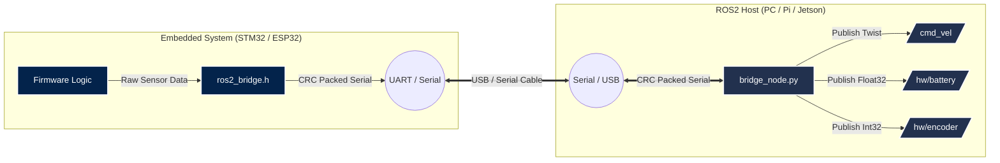

<div align="center">


**The Zero-Friction Communication Layer Between ROS2 and Embedded Microcontrollers**


[](https://github.com/EngineerAbdullahBinZafar/ros2-hardware-bridge/actions)
[](https://opensource.org/licenses/MIT)
[](https://docs.ros.org/en/humble/index.html)
[](#)

*Forget the immense complexity of micro-ROS. Get your STM32 talking to ROS2 in **under 3 minutes**.*

[Features](#-key-features) • [Quick Start](#%EF%B8%8F-quick-start-zero-friction) • [Architecture](#-architecture) • [Documentation](#-supported-message-ids) • [Contributing](#-contributing)

</div>

---

## 🚀 Why Use This?

Every robotics engineer faces the exact same challenge: **"How do I get my microcontroller to talk to my ROS2 PC reliably without going crazy?"**

Common solutions like `micro-ROS` are incredibly powerful but severely over-engineered for simple sensor/actuator bridges. **`ros2-hardware-bridge`** provides the ultimate middle ground:

- ⚡ **Zero Configuration**: No complex build systems, no DDS agents to configure.
- 🛡️ **Type Safety**: Pre-defined packet structures mapped directly to native ROS2 types (Twist, Pose, Battery, Encoders).
- 🧩 **Fault Tolerant**: Built-in CRC checksums silently drop noisy serial garbage.
- 🪶 **Ultra-Lightweight**: The C-firmware library is `< 1KB` and has **zero external dependencies**.

---

## ⚡️ Quick Start (Zero-Friction)

Get up and running in 3 commands.

### 1. ROS2 Host (PC/Raspberry Pi)
Clone and build the package in your ROS2 workspace:

```bash
cd ~/ros2_ws/src
git clone https://github.com/EngineerAbdullahBinZafar/ros2-hardware-bridge.git
cd ~/ros2_ws
colcon build --packages-select ros2_hardware_bridge
source install/setup.bash

# Launch the bridge on your serial port
ros2 run ros2_hardware_bridge bridge_node --ros-args -p port:=/dev/ttyACM0
```

### 2. Firmware (STM32 / ESP32 / Arduino)
Simply include the single header file `ros2_bridge.h` and use the serialization functions.

```cpp
#include "ros2_bridge.h"

// Example: Send battery voltage to ROS2
float voltage = 12.6f;
uint8_t tx_buf[32];

// Serialize data (ID 0x10 = Battery Voltage)
int len = bridge_serialize(0x10, (uint8_t*)&voltage, sizeof(float), tx_buf);

// Transmit via UART (STM32 HAL example)
HAL_UART_Transmit(&huart1, tx_buf, len, 10);
```

---

## 📐 Architecture

Our custom packet protocol guarantees that your ROS2 ecosystem never sees corrupted data.



---

## 📦 Supported Message IDs

| Packet ID | Description | ROS2 Topic Name | Standard Data Type |
|:---:|:---|:---|:---|
| `0x01` | Velocity Command | `/cmd_vel` | `geometry_msgs/Twist` |
| `0x10` | Battery Voltage | `/hw/battery` | `std_msgs/Float32` |
| `0x11` | Encoder Ticks | `/hw/encoder` | `std_msgs/Int32` |

*(Need more messages? See [Contributing](#-contributing) to easily add your own!)*

---

## 🤝 Contributing

We want to make this the universal standard for simple ROS2 hardware interfacing. 

1. Read our [Contributing Guidelines](CONTRIBUTING.md) and [Code of Conduct](CODE_OF_CONDUCT.md).
2. Fork the repository.
3. Submit a Pull Request.

**High-Priority Bounties:**
- Adding support for `sensor_msgs/Imu` and `sensor_msgs/LaserScan`.
- High-performance C++ implementation of the ROS2 host node.

---

## 📄 License
Distributed under the MIT License. See `LICENSE` for more information.

## 👤 Author

Developed with passion by **Engineer Abdullah Bin Zafar**.
*If this project saved you hours of debugging `micro-ROS`, consider dropping a ⭐!*

[](https://linkedin.com/in/abdullah-bin-zafar)
[](https://github.com/EngineerAbdullahBinZafar)
