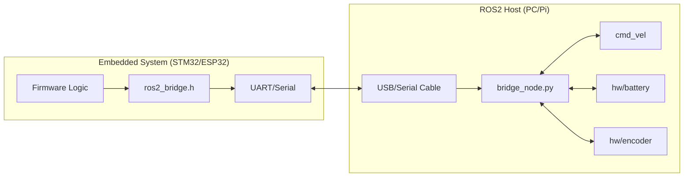

# 🌉 ROS2 Hardware Bridge: The Missing Link

[](https://opensource.org/licenses/MIT)
[](https://docs.ros.org/en/humble/index.html)
[](#)

**`ros2-hardware-bridge`** is a high-performance, plug-and-play communication layer between ROS2 and embedded microcontrollers. It eliminates the complexity of `micro-ROS` while providing a robust, packet-safe serial protocol for real-time robotics control.

---

## 🚀 Why Use This?

Every robotics engineer faces the same challenge: **"How do I get my STM32 to talk to my ROS2 PC reliably?"**

Common solutions like `micro-ROS` are powerful but often too complex for simple sensor/actuator bridges. `ros2-hardware-bridge` provides a middle ground:
- ✅ **Zero configuration**: No complex build systems or DDS agents.
- ✅ **Type Safety**: Pre-defined packet structures for common ROS2 types (Twist, Pose, Battery, Encoders).
- ✅ **Fault Tolerant**: Built-in CRC checksums to handle serial noise.
- ✅ **Lightweight**: The firmware library is <1KB and has zero dependencies.

---

## 📐 Architecture



---

## 🛠️ Getting Started

### 1. Firmware Side (C/C++)
Include `ros2_bridge.h` in your project and use it to serialize your data:

```cpp
#include "ros2_bridge.h"

// Send battery voltage to ROS2
float voltage = 12.6f;
uint8_t tx_buf[32];
int len = bridge_serialize(0x10, (uint8_t*)&voltage, sizeof(float), tx_buf);
HAL_UART_Transmit(&huart1, tx_buf, len, 10);
```

### 2. ROS2 Side (Python)
Install and run the bridge node:
```bash
# Clone and build
cd ~/ros2_ws/src
git clone https://github.com/EngineerAbdullahBinZafar/ros2-hardware-bridge.git
cd ..
colcon build --packages-select ros2_hardware_bridge
source install/setup.bash

# Run the bridge
ros2 run ros2_hardware_bridge bridge_node --ros-args -p port:=/dev/ttyACM0
```

---

## 📦 Supported Message IDs

| ID | Description | ROS2 Topic | Data Type |
|----|-------------|------------|-----------|
| `0x01` | Velocity Command | `/cmd_vel` | `geometry_msgs/Twist` |
| `0x10` | Battery Voltage | `hw/battery`| `std_msgs/Float32` |
| `0x11` | Encoder Ticks | `hw/encoder`| `std_msgs/Int32` |

---

## 🤝 Contributing
This project aims to be the universal standard for simple ROS2 hardware interfacing. We welcome PRs for:
- Support for more message types (IMU, LaserScan).
- C++ implementation of the ROS2 node.
- Example projects for ESP32/Arduino.

## 📄 License
Distributed under the MIT License. See `LICENSE` for more information.

## 👤 Author
**Engineer Abdullah Bin Zafar**
- GitHub: [@EngineerAbdullahBinZafar](https://github.com/EngineerAbdullahBinZafar)
- LinkedIn: [Abdullah Bin Zafar](https://www.linkedin.com/in/abdullah-bin-zafar/)
